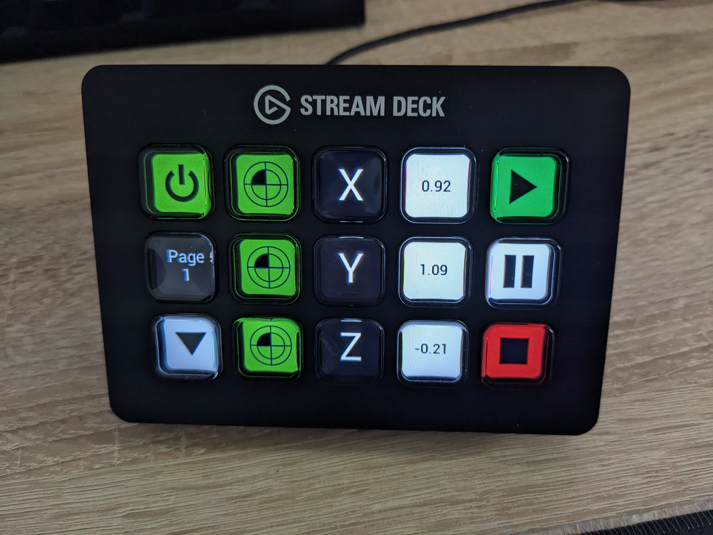

## Intro

HalDeck provides StreamDeck support for LinuxCNC, allowing deck buttons to reflect and control HAL pins.
This allows creating responsive, tactile user interfaces for LinuxCNC machines.





## Installation
    
- some packages
```
sudo apt install libhidapi-libusb0 python3-pip python3-pynput usbutils
```

- python3 streamdeck library
```
python3 -m pip install streamdeck  --user --break-system-packages
```    


## Configure


- in work


## Run example / demo

```
cd linuxcnc
cd configs
git clone https://github.com/talla83/haldeck.git haldeck
cd haldeck
linuxcnc haldeck_demo.ini
```


## Credits

Thanks to all patrons for their support.
www.patreon.com/Talla83
